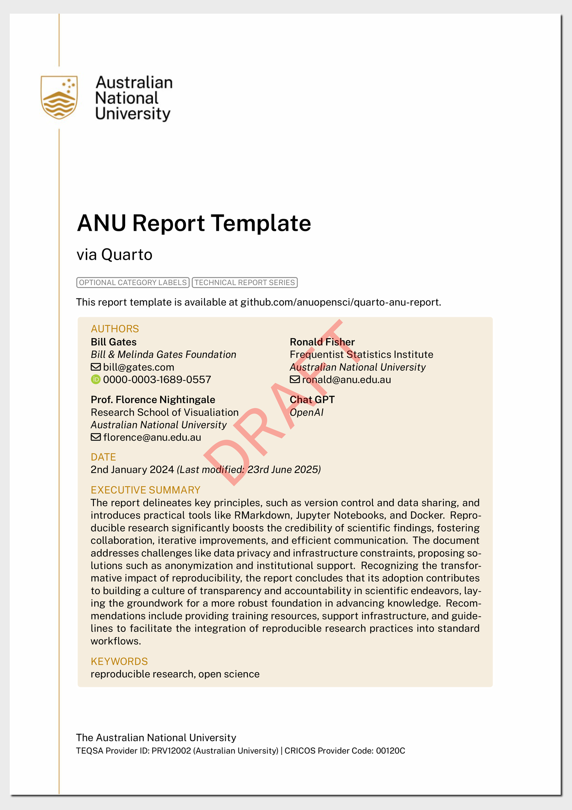

<!-- README.md is generated from README.qmd. Please edit that file -->

# Quarto template for ANU Report

This is a work-in-progress! Currently HTML is the only one developed.

## Installing

``` bash
quarto use template anu-links/quarto-anu-report
```

This will install the extension and create an example qmd file that you
can use as a starting place for your article.

## Format Options

There are two formats: PDF and HTML. PDF format is not developed yet.

### `anu-report-html`


### `anu-report-pdf`

[](examples/template.pdf)
